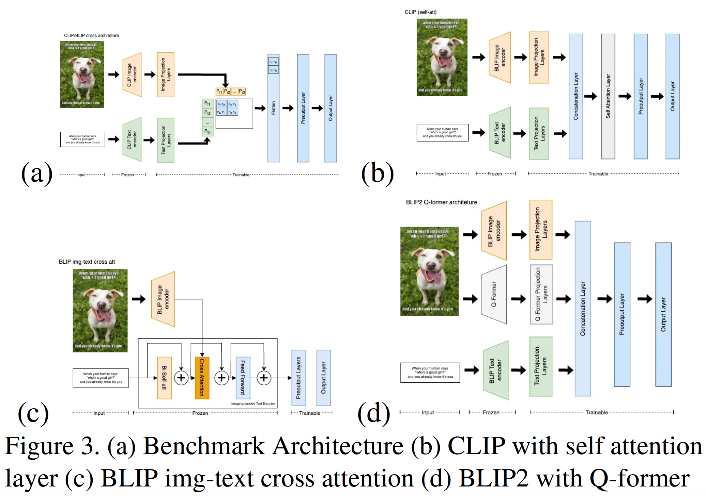

---
# Multimodal Hateful Meme Classification using Vision-Language Models
---

## Abstract

This project investigates the performance and robustness of newer transformer-based vision-language models (CLIP, BLIP, ViLT) on Facebook AI's Hateful Memes Challenge, moving away from older models reliant on computationally expensive object detectors. We highlight CLIP's superior performance in meme classification, attributing it to its larger, diverse training dataset and its ability to learn representations tailored for multimodal tasks. The study also underscores the models' vulnerability to adversarial attacks and demonstrates that adversarial training can enhance both robustness and generalizability.

## Overview

This project explores the application of contemporary vision-language models (CLIP, BLIP, ViLT) to the task of hateful meme detection. We evaluate their performance and robustness, analyzing the impact of architectural choices and vulnerability to adversarial attacks. Our findings highlight the strengths of CLIP and the challenges in effectively processing multimodal content for social media analysis.

## Introduction

Memes have become a dominant form of communication in the digital age, yet their potential for harm, particularly in spreading hateful content, presents a significant challenge for online platforms. The Hateful Memes Challenge, launched by Meta AI, aimed to address this issue by exploring whether machine learning models could be developed to effectively detect hateful content in multimodal memes. This is a complex problem, as these memes combine both image and text, requiring AI to understand not just individual elements but also their interplay and the subtle contextual nuances that can convey harmful messages.

In this project, we investigated the application of recent advancements in vision-language models to tackle this difficult task. Specifically, we focused on evaluating the performance and robustness of models like CLIP, BLIP, and ViLT, which offer streamlined architectures compared to earlier approaches that relied on computationally expensive object detectors. Our work sought to establish performance baselines, explore architectural modifications, and, crucially, assess the vulnerability of these models to adversarial attacks.

The ability to accurately detect hateful memes has significant implications for online safety. Effective AI tools in this domain could help platforms to proactively identify and remove harmful content, protecting vulnerable communities and mitigating the spread of online hate. This research contributes to that goal by providing a deeper understanding of the capabilities and limitations of current vision-language models in this challenging real-world application.

## Methodology

Our methodology centered on leveraging pre-trained vision-language models—CLIP, BLIP, and ViLT—from Hugging Face and fine-tuning them on the Hateful Memes Challenge dataset.

**Models Explored:**
* **CLIP (Contrastive Language-Image Pre-Training):** Employs separate image (ViT-based) and text (Transformer-based) encoders, trained to maximize cosine similarity for correct image-text pairs.
* **BLIP (Bootstrapping Language-Image Pre-training):** Utilizes a unimodal encoder, an image-grounded text encoder, and an image-grounded text decoder, with objectives like image-text contrastive loss and matching loss. We also explored BLIP-2.
* **ViLT (Vision-and-Language Transformer):** Processes images as series of patches and uses a single transformer encoder for both modalities, aiming for efficiency.

**Modelling Assessments:**
1.  **Zero-Shot Capability Testing:** Evaluated models' ability to classify memes as 'hateful' or 'non-hateful' without prior fine-tuning on the challenge dataset, using class labels as text inputs.
2.  **Fine-tuning without Architectural Modifications:** Fine-tuned the final layers of CLIP and BLIP on the challenge dataset.
3.  **Fine-tuning with Architectural Modifications:** Implemented and tested several architectural changes, inspired by works like Hate-CLIPper. This involved adding layers on top of base models and exploring different methods to combine image and text encodings, such as:
    * Simple concatenation of image and text encodings.
    * Batch Matrix Multiplication (BMM) between image and text encodings.
    * Self-attention on the concatenated image-text encodings.
    These combined features were then passed through additional classification layers.

**Adversarial Robustness Evaluation:**
* **Grey-box Attacks:** Generated adversarial images by attacking a publicly available pre-trained CLIP model (not our fine-tuned version) using Projected Gradient Descent (PGD) to maximize cross-entropy loss towards incorrect labels.
* **Black-box Attacks:** Simulated realistic bypass attempts using simple data augmentations via Meta AI's AugLy library (e.g., random noise, greyscale for images; typos, unicode character replacement for text) and adversarial patching (overlaying emojis).
* **Adversarial Training:** Retrained our best-performing model on a dataset augmented with a subset of these adversarial examples to assess improvements in robustness.

*Figure: Example of a modified CLIP architecture explored (inspired by Hate-CLIPper, Figure 3a from the paper).*

## Results and Discussion

Our research yielded several key findings regarding the performance and robustness of vision-language models in hateful meme detection:

* **CLIP's Superiority in Hateful Meme Detection:** Across our experiments, CLIP consistently outperformed BLIP and ViLT in classifying hateful memes. For instance, a fine-tuned CLIP (without extensive architectural modifications) achieved a test AUC of 0.774 and accuracy of 70.7%, surpassing BLIP (0.697 AUC, 67.9% accuracy). This superiority is likely due to CLIP's pre-training on a significantly larger and more diverse dataset (unannotated natural data), enhancing its ability to discern complex image-text relationships.

* **The Impact of Training Data and Strategy:** CLIP's strategy of training its image encoder from scratch allows it to develop representations specifically tailored for multimodal classification. In contrast, BLIP and ViLT, which often utilize pre-trained weights for their encoders (e.g., ViLT using pre-trained ViT on ImageNet), may not capture multimodal nuances as effectively without extensive fine-tuning or architectural adaptation for the specific task.

* **Effective Multimodal Integration:** CLIP's implicit integration of text and image modalities through joint contrastive training appears more effective for this task. Operations like Batch Matrix Multiplication (BMM) on CLIP's features, aligning attention between image and text, further boosted performance. BLIP's explicit cross-attention mechanisms and ViLT's use of a single shared transformer encoder for both modalities showed limitations in generating feature representations as effective as CLIP's for this specific challenge.

* **Vulnerability to Adversarial Attacks:** All models demonstrated vulnerability to adversarial attacks.
    * **Image Modality:** PGD attacks in a grey-box setting (attacking pre-trained CLIP) showed poor transferability to our fine-tuned models but still achieved success rates around 17-18%. More concerningly, simple black-box attacks like overlaying emojis on memes proved surprisingly effective (around 10-11% success rate), highlighting a practical vulnerability.
    * **Text Modality:** Text-based attacks (e.g., unicode character replacement) were less effective (around 5-6% success rate), suggesting the image modality often carries more weight in the model's decision for this task.
    * **Combined Attacks:** Combining image (PGD) and text (unicode) attacks led to the most significant model degradation, with the test AUC of one CLIP variant dropping by over 10%.

* **Adversarial Training Enhances Robustness and Generalization:** Adversarially training our CLIP (Concat) model with a 10% subset of augmented data significantly improved its resilience. The success rate of combined attacks dropped (e.g., by ~6% on the test set), and the AUC drop was reduced by about 5 times. Interestingly, this adversarial training also improved the model's performance on the *original, non-adversarial* dev and test datasets (e.g., test AUC increased from 0.785 to 0.804, and accuracy from 73.3% to 75.2%), suggesting it helped the model learn more robust and generalizable features.

**Model Performance Highlights (Top Models from Study):**
| Model Configuration        | Dev-unseen AUC | Dev-unseen ACC | Test-unseen AUC | Test-unseen ACC |
|----------------------------|----------------|----------------|-----------------|-----------------|
| Hate-CLIPper (Benchmark)   | 0.811          | 76.7%          | 0.824           | 75.6%           |
| CLIP concat (Our Impl.)    | 0.761          | 70.2%          | 0.785           | 73.3%           |
| BLIP-2 ViT-L FlanT5 XL     | 0.733          | 70.9%          | 0.764           | 71.6%           |

*(Note: "CLIP concat" refers to one of our architectural modification experiments. The "Hate-CLIPper" row refers to the benchmark model architecture we aimed to reproduce and build upon, as cited in the paper.)*

## My Contributions

My primary contributions to this project, as part of the team, included:

* **CLIP Implementation and Adaptation:**
    * Reproduced the model architecture and results from the Hate-CLIPper paper as a baseline.
    * Performed extensive fine-tuning of various CLIP model versions.
    * Implemented and experimented with several architectural modifications to the CLIP model to explore potential performance enhancements.
    * Conducted comparative analysis of CLIP's performance against BLIP and BLIP-2 models under various configurations.

## Challenges and Limitations

* **Hardware Requirements:** Training complex models posed a significant hardware challenge. Unlike top competitors, we lacked the resources for extensive model ensembling. Our best model, while competitive, did not utilize ensembling. Future work could explore ensembling modern vision-language architectures.
* **Computational Complexity of Adversarial Attacks:** Generating adversarial examples, particularly with PGD, was computationally intensive. Due to resource constraints, we focused our adversarial evaluation and retraining on a single model (CLIP), based on the hypothesis that adversarial attacks would have similar effects across models. Future research could examine model-specific robustness in more detail.

## Skills Demonstrated
* Multimodal Machine Learning (Vision-Language Models)
* Deep Learning Model Implementation (CLIP, BLIP)
* Model Fine-tuning, Architectural Modification, and Evaluation
* Adversarial Attack Generation (PGD, AugLy) and Robustness Analysis
* Adversarial Training Techniques
* Experimental Design and Execution
* Data Analysis and Interpretation
* Python, PyTorch, Hugging Face Transformers

## Link to Full Paper

[Link to full paper (PDF)](https://github.com/lowweihong/meme-challenge/blob/main/Hateful_Memes___CS_7643_Report.pdf)
