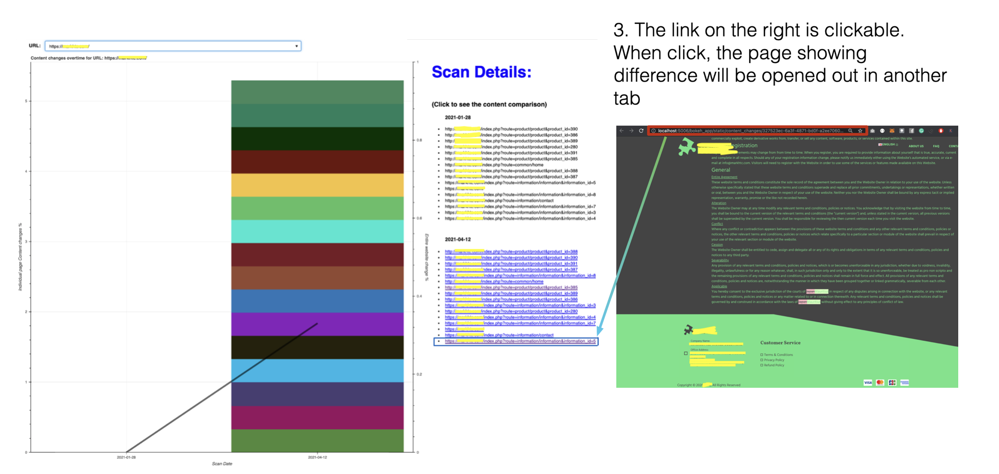

## Dashboard

- An in-house interactive dashboard designed to monitor changes in web content over time for a specific URL. Below is a demo page shown in the screenshot:
  

## NLP / Computational linguistics

- [HatefulMeme challenge](https://github.com/lowweihong/meme-challenge): In this project, I leveraged the power of the [CLIP (Contrastive Language-Image Pretraining)](https://github.com/openai/CLIP) to address the critical issue of hateful content in online media, specifically targeting memes. By developing a robust training pipeline, I aimed to enhance the model's ability to accurately classify and understand the nuances of memes that may propagate harmful narratives. This capability has significant implications for businesses and platforms that rely on user-generated content, as it can help in automating the detection of inappropriate material, thereby fostering a safer online environment. The project not only showcases my technical skills in machine learning and data processing but also highlights my commitment to applying AI solutions to real-world challenges, ultimately contributing to brand integrity and user trust.

- **Web Content Classification**: This project focuses on classifying multilingual web content using a streamlined pipeline that combines semantic embeddings and machine learning. I utilized the [BAAI/bge-m3](https://huggingface.co/BAAI/bge-m3) model to extract high-dimensional semantic embeddings from scraped web data, capturing rich contextual information. These embeddings were then classified using a Logistic Regression model, which provided efficient and accurate results.

## Anomaly Detection

- **Online Payment Fraud Detection**: This project uses Variational Autoencoders (VAE) to detect fraud in transactional data with unsupervised learning. The VAE was trained to reconstruct latent representations of these transactions, with reconstruction errors serving as indicators of anomalous or potentially fraudulent activities. Key steps included feature extraction through domain-specific engineered features, one-hot encoding of categorical variables, and scaling numerical features such as credit card expiry dates and billing amounts. The pipeline also integrated dimensionality reduction using Truncated Singular Value Decomposition (TSVD) to improve computational efficiency, followed by normalization to ensure numerical stability for downstream processing.

## IOT

- **Snapmeter** (Company project): Designed and implemented IOT data collection worfklow + exposition worfklow in order to monitor onsite gauge meter for gas consumption with a Raspberry Pi.

## Community Prediction Competition

- [**COVID 19 faceshield supply monitoring**](https://lookerstudio.google.com/reporting/1aaae16a-b02e-4742-b2c7-b7d13e5f1dff): End-to-end data collection with google form from community distributor, and streamline the insights on Looker Studio to allow effective distribution of community initiative for faceshield.

