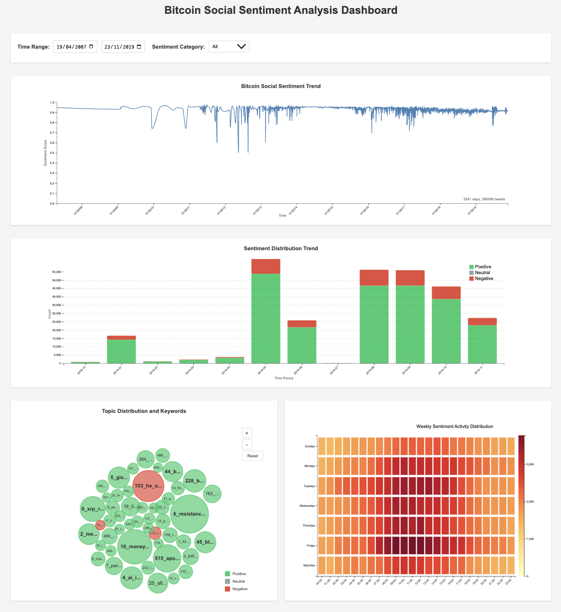
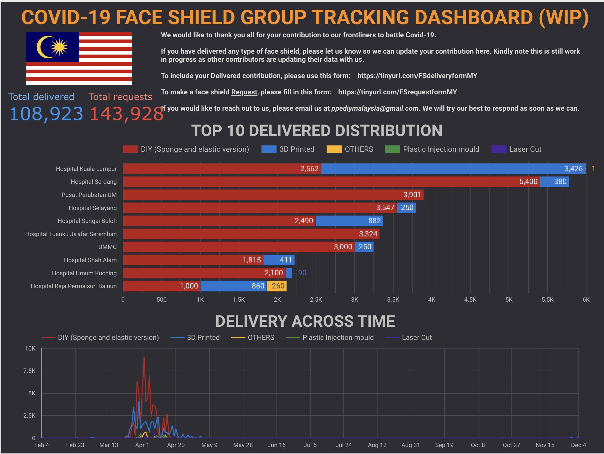
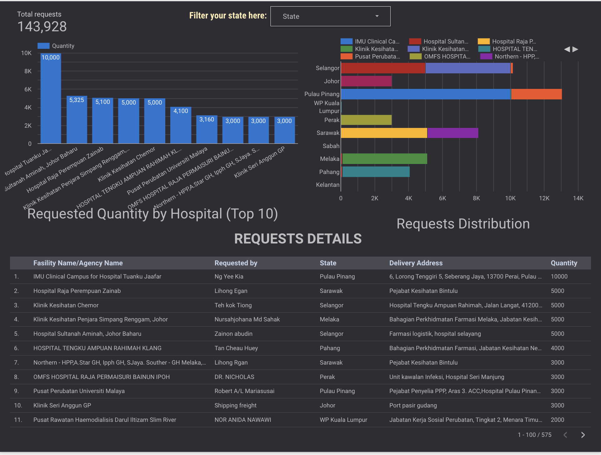
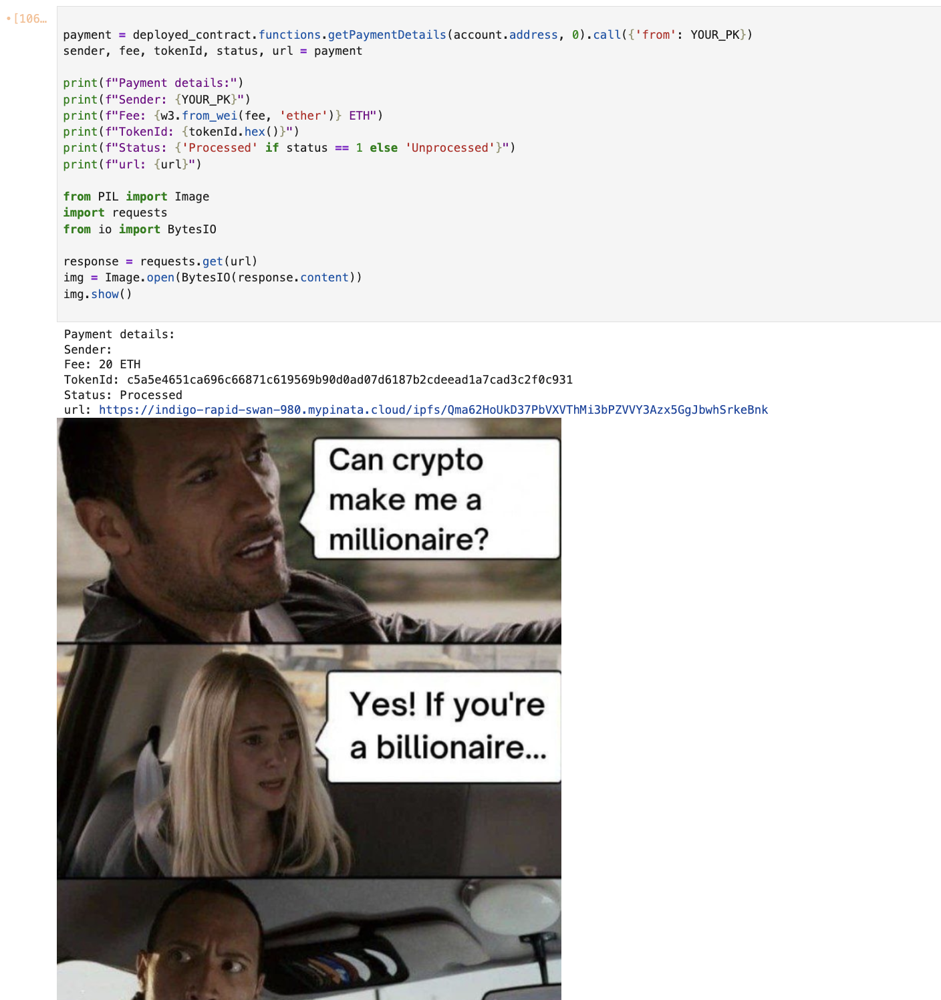

## Overview

I thrive on tackling a diverse range of projects across multiple domains, allowing me to continuously learn and apply my skills in innovative ways. My project experience is primarily built upon four key pillars:

1.  **[Multimodal & Language Processing](#multimodal--language-processing)**: Developing solutions for text analysis, understanding semantics, processing multiple modalities (like image and text), and building classification models.
    * *Skills*: Text Analysis, Semantic Embeddings (e.g., BAAI/bge-m3), Multimodal Classification (e.g., CLIP), Image & Text Feature Extraction, Text Preprocessing, Model Fine-tuning.  
2.  **[Machine Learning & Anomaly Detection](#anomaly-detection)**: Designing and implementing machine learning models to identify unusual patterns, with a focus on fraud detection in transactional and other data types.
    * *Skills*: Anomaly Detection, Fraud Detection, Unsupervised Learning (e.g., Variational Autoencoders), Feature Engineering, Dimensionality Reduction (e.g., TSVD), Supervised Learning (e.g., Logistic Regression).
3.  **[Data Visualization & Dashboards](#dashboards--data-visualization)**: Crafting interactive dashboards and visualization tools to effectively communicate data-driven insights. 
    * *Skills*: Dashboard Development, Data Visualization (e.g., D3.js, Looker Studio), End-to-End Data Pipelines for Reporting.  
4.  **[Web3 & Blockchain](#web3--blockchain)**: Exploring and implementing solutions leveraging blockchain technology and decentralized systems.
    * *Skills*: Blockchain Technology, Decentralized Systems, Smart Contract Development (Solidity).  

Below is a selection of projects that highlight my contributions and expertise across these areas.

---

## Featured Projects

### Multimodal & Language Processing

* **[Hateful Meme Detection Challenge](blog.md)**
    * **Objective**: Addressed the critical issue of identifying hateful content in multimodal memes by leveraging OpenAI's CLIP model.
    * **My Role & Contribution**: Developed a robust training and fine-tuning pipeline for CLIP, enhancing its ability to accurately classify memes. This involved architectural modifications to the base CLIP model, exploring different methods for combining image and text encodings (concatenation, Batch Matrix Multiplication, self-attention), and conducting experiments to optimize performance. The project also involved assessing model robustness against adversarial attacks and implementing adversarial training techniques.
    * **Impact**: This work contributes to creating safer online environments by providing a foundation for automated detection of harmful user-generated content. It demonstrates advanced skills in multimodal machine learning, model adaptation, and applying AI to pressing real-world societal challenges.
    * **Technologies**: Python, PyTorch, CLIP, Hugging Face Transformers.
    * Link to full paper: [CS 7643 Report](https://github.com/lowweihong/meme-challenge/blob/main/Hateful_Memes___CS_7643_Report.pdf)

* **Multilingual Web Content Classification**
    * **Objective**: Classified diverse web content across multiple languages using a streamlined machine learning pipeline.
    * **Approach**: Utilized the `BAAI/bge-m3` model to generate high-dimensional semantic embeddings from scraped web data, capturing rich contextual information. These embeddings were then fed into a Logistic Regression model for efficient and accurate classification.
    * **Skills**: Semantic Embeddings, Text Classification, Web Scraping, Multilingual Data Processing, Machine Learning Pipeline Development.
    * **Technologies**: Python, Hugging Face Transformers (`BAAI/bge-m3`), Scikit-learn.

---

### Anomaly Detection

* **Online Payment Fraud Detection using Variational Autoencoders (VAE)**
    * **Objective**: Developed an unsupervised learning system to detect fraudulent transactions in online payment data.
    * **Approach**: Trained a Variational Autoencoder (VAE) to learn latent representations of legitimate transactions. Anomalous or potentially fraudulent activities were identified based on high reconstruction errors.
    * **Key Steps**:
        * Engineered domain-specific features relevant to payment transactions.
        * Applied one-hot encoding for categorical variables.
        * Scaled numerical features (e.g., credit card expiry dates, transaction amounts).
        * Utilized Truncated Singular Value Decomposition (TSVD) for dimensionality reduction to improve computational efficiency.
        * Normalized data to ensure numerical stability for the VAE.
    * **Skills**: Unsupervised Learning, Anomaly Detection, Fraud Detection, Variational Autoencoders, Feature Engineering, Dimensionality Reduction.
    * **Technologies**: Python, TensorFlow/Keras, Scikit-learn, Pandas.

---

### Internet of Things (IoT)

* **Snapmeter**
    * **Objective**: Designed and implemented an end-to-end IoT solution to monitor on-site gas consumption using utility gauge meters.
    * **My Role & Contribution**: Developed the data collection workflow using a Raspberry Pi to capture meter readings. Implemented the data exposition workflow to transmit, store, and visualize consumption data for monitoring and analysis.
    * **Impact**: Enabled remote and automated monitoring of gas consumption, leading to improved operational efficiency and timely insights.
    * **Technologies**: Python, Raspberry Pi.

---

### Dashboards & Data Visualization

* **Social Analytics Dashboard for Bitcoin Discussion**
    * **Objective**: Developed an interactive dashboard to analyze and visualize sentiment trends and topical dynamics within Bitcoin-related discussions on X (formerly Twitter) in real time, providing a richer, narrative-aware view of the Bitcoin ecosystem.
    * **Features**:
        * Real-time (historical data used as prototype) analysis of Bitcoin-related social media discussions.
        * Visualization of sentiment trends (positive, negative, neutral) over time.
        * Topic modeling to uncover and display latent themes and emerging narratives.
        * Interactive visualizations including sentiment line charts, stacked area charts, activity heatmaps, and dynamic word clouds.
        * Filtering capabilities based on date ranges and sentiment categories.
        * Utilized domain-specific language models for nuanced understanding of crypto-related text.
    * **Technologies**: Python, CryptoBERT, BERTopic, D3.js, UMAP, HDBSCAN, KeyBERT, Llama-3.1, Pandas.
    * **Presentation Link**: [View Presentation](https://youtu.be/zcI3e_506hI)
    * *Screenshot:*
      

* **Web Content Change Monitoring Dashboard**
    * **Objective**: Created an in-house interactive dashboard to track and visualize changes in web content for specific URLs over time.
    * **Features**: Allowed users to monitor updates, modifications, or removals of content, providing valuable insights for competitive analysis, SEO tracking, or compliance monitoring.
    * **Technologies**: Python (Flask,Bokeh,seaborn), AWS Athena, diff.js
    * *Screenshot:*
        

* **[COVID-19 Faceshield Supply & Distribution Monitoring](https://lookerstudio.google.com/reporting/1aaae16a-b02e-4742-b2c7-b7d13e5f1dff)**
    * **Objective**: Developed an end-to-end data pipeline and dashboard to monitor the supply and aid in the effective distribution of community-sourced faceshields during the COVID-19 pandemic.
    * **Approach**: Utilized Google Forms for data collection from community distributors. Streamlined data processing and presented insights via an interactive Looker Studio (formerly Google Data Studio) dashboard.
    * **Impact**: Facilitated efficient allocation and distribution of critical PPE to those in need by providing clear, actionable insights to organizers.
    * **Technologies**: Google Forms, Google Sheets, Looker Studio.
      * *Screenshots:*  
        

        
        
        

### **Web3 & Blockchain**
* **Meme Merchant Contract (ShibaPayment)**
    * **Objective**: Developed a Solidity smart contract to manage and track payments, potentially for digital items or meme-related content, associating each transaction with a unique token ID and an image URL (e.g., IPFS link).
    * **Features**:
        * Allows users to make payments (e.g., in ETH/native currency) to the contract.
        * Records detailed payment information including sender, amount, a unique transaction token ID, status (e.g., processed/unprocessed), and an image URL.
        * Enables the contract owner to update the image URL and status associated with each payment.
        * Implements access control for administrative functions (e.g., status updates, withdrawals).
        * Tracks payment history per user and maintains a list of all transacting users.
        * Provides functions to query payment counts, specific payment details, and a user's entire payment history.
        * Owner can withdraw accumulated funds from the contract.
        * Emits events for key actions like payment receipt and updates to payment status or image URL.
    * **Technologies**: Solidity (`^0.5.0`), Ethereum Virtual Machine (EVM), IPFS (pinata).
    * **Repository Link**: [View Code on GitHub](https://github.com/lowweihong/meme-merchant-contract)
    * *Screenshot:*
        
